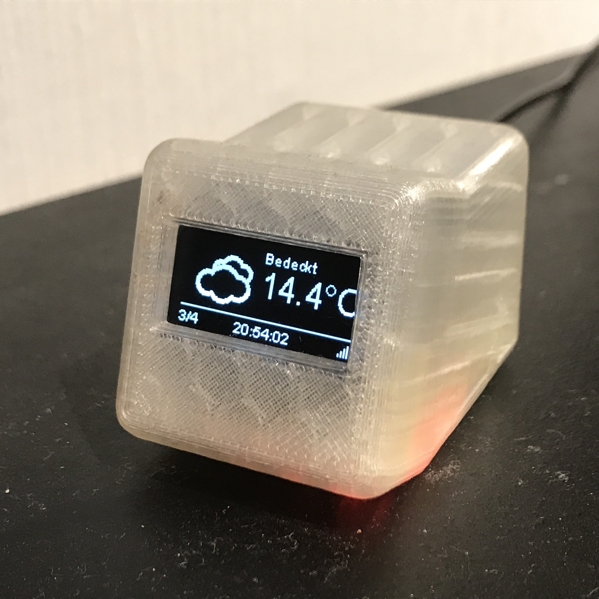
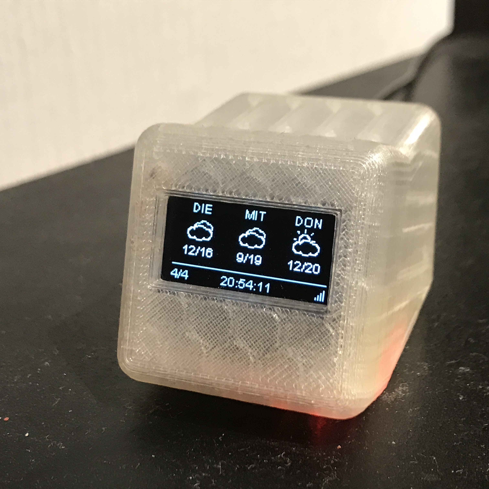
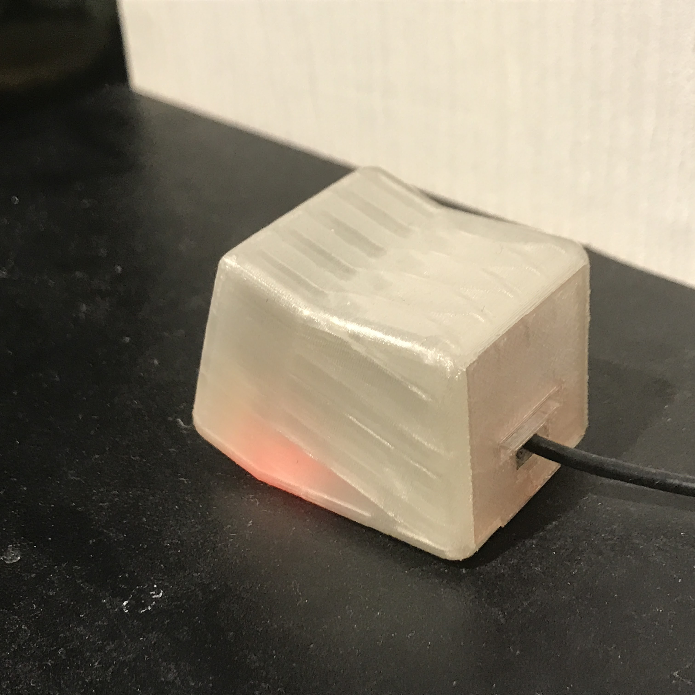

# Homie Display

Several Homie node(s) that wrap different data sources and show them on an OLED display.
This firmware currently contains four frames
* A status frame showing MQTT/Wifi status upon initialization and the current time when everything is up and running
* The current weather for a weather station that you have configured, fetched via [Weather Underground](https://www.wunderground.com/)
* A three day weather forecast for the same weather station
* Temperature and humidity fetched from a mqtt server using data as defined in my [Homie Node Collection](https://github.com/luebbe/homie-node-collection)

The time zone, weather underground URL and the mqtt topics for temperature/humidity are configurable

The software is based on [Homie (v2.0)](https://github.com/marvinroger/homie-esp8266) and is developed using [PlatformIO](https://github.com/platformio)

## Dependencies
All dependencies are included via platformio.ini

## Weather Underground
It uses files copied from [ESP8266 Weather Station](https://github.com/squix78/esp8266-weather-station) to access the weather underground API. These files are copied into the lib subdirectory. The entire weather station library is not included, because it has its own NTP client with a different interface than the one that I prefer.

## Configuration
The following parameters are used to configure the display

Node | Parameter | Type | Usage
---- | --------- | ---- | -----
MqttNode            | MqttServer          | string      | The MQTT server to which this node shall connect|
MqttNode            | MqttTopic           | string      | The MQTT topic to which this node shall listen|
MqttNode            | MqttTitle           | string      | The title that shall be shown on the frame|
StatusNode          | TcOffset            | long        | The time zone offset for the NTP client in hours (-12 .. 12)|
StatusNode          | TcUpdate            | long        | The update interval in minutes for the NTP client (must be at least 10 minutes)|
Weather Underground | WuApiKey            | string      | Your weather underground API key|
Weather Underground | WuLanguage          | string      | The language in which you want to retrieve the weather underground data|
Weather Underground | WuCountry           | string      | The country in which your citie lies|
Weather Underground | WuCity              | string      | The city for which you want to retrieve the weather underground data|
Weather Underground | WuUpdate            | long        | The update interval in minutes for weather underground (must be at least 10 minutes)|

## Case
A friend of mine printed this cute little case for me: [Desktop Widget](https://www.thingiverse.com/thing:857858/#files)

|  |  |  |
|:---:|:---:|:---:|
|  Front view showing current weather | Front view showing three day forecast | Rear view |
