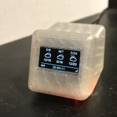

# Homie Display

Several Homie node(s) that wrap different data sources and show them on an OLED display.
This firmware currently contains four frames

- A status frame showing MQTT/Wifi status upon initialization and the current time when everything is up and running
- The current weather for a open weathermap location Id that you have configured, fetched via [Open Weathermap](https://openweathermap.org/)
- A three day weather forecast for the same location
- Temperature and humidity fetched from a mqtt server using data as defined in [Homie Node Collection](https://github.com/luebbe/homie-node-collection)

The time zone, open weathermap URL and the mqtt topics for temperature/humidity are configurable

The software is based on [Homie (v2.0)](https://github.com/marvinroger/homie-esp8266) and is developed using [PlatformIO](https://github.com/platformio)

## Dependencies

All dependencies are included via platformio.ini

## Open Weathermap

It uses files copied from [ESP8266 Weather Station](https://github.com/ThingPulse/esp8266-weather-station) to access the open weathermap API. These files are copied into the lib subdirectory. The entire weather station library is not included, because it has its own NTP client with a different interface than the one that I prefer.

## Configuration

The following parameters are used to configure the display

| Node           | Parameter     | Type   | Usage                                                                    |
| -------------- | ------------- | ------ | ------------------------------------------------------------------------ |
| MqttNode       | MqttServer    | string | The MQTT server to which this node shall connect                         |
| MqttNode       | MqttTopic     | string | The MQTT topic to which this node shall listen                           |
| MqttNode       | MqttTitle     | string | The title that shall be shown on the frame                               |
| OpenWeathermap | OwmApiKey     | string | Your open weathermap API key                                             |
| OpenWeathermap | OwmLanguage   | string | The language in which you want to retrieve the open weathermap data      |
| OpenWeathermap | OwmLocationId | string | The location for which you want to retrieve the weather information      |
| OpenWeathermap | OwmUpdate     | long   | The update interval in minutes for open weathermap (10 minutes to 1 day) |

## Case

A friend of mine printed this cute little case for me: [Desktop Widget](https://www.thingiverse.com/thing:857858/#files) found on Thingiverse.

|  |  |  |
| :--------------------------------------------------: | :-----------------------------------------------------: | :------------------------------------------: |
| Current weather                                      | Three day forecast                                      | Rear view                                    |
